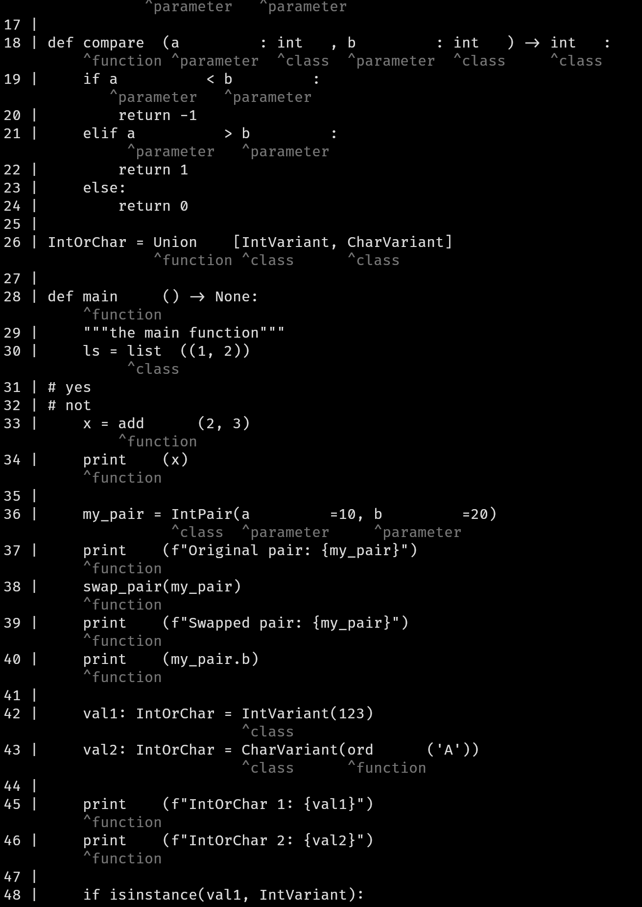

# Demo on LSP
You can also use it for debugging an LSP.

requirements (must be in PATH):
* C: clangd-18
* Rust: rust-analyzer
* Python: python-lsp-server
* python 3.10+

Usage:
```sh
python client_obj.py # interactive use
# for API use, read the code
```

# Example results
## C

## Rust

## Python

